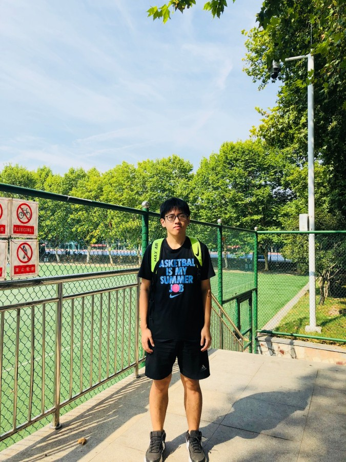

# __Yafan Huang__ 黄亚凡

## __Education__

###   __Huazhong University of Science and Technology__, Wuhan, China

<i>Sep.2018 - Jun.2021</i>

- Master in Computer Science
- Major GPA: __3.51__, Cumulative GPA: __3.43__
- Knowledge Graph, Natural Language Processing.

###  __Hunan University__, Changsha, China

<i>Sep.2014 - Jun.2018</i>

- Bachelor in Software Engineering
- Major GPA: __3.44__, Cumulative GPA: __3.39__
- Class President, [Campus Singer](https://music.163.com/#/song?id=1296131496).

## __What does Yafan Huang look like?__
<<<<<<< HEAD

Sep. 2018 in Mid-playground of HUST, Wuhan, China

=======

Sep. 2018 in Mid-playground of HUST, Wuhan, China
>>>>>>> c742e57d14bd4de6d2df1dfc5a0af5a4af44d518
